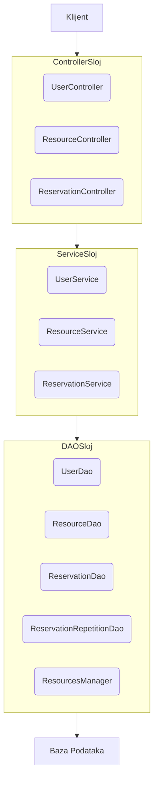

## 1. Uvod

Ovaj dokument detaljno opisuje arhitektonske i implementacione odluke donete tokom razvoja REST API serverske aplikacije za sistem rezervacije termina i resursa. Cilj je da se pruži jasno objašnjenje kako su ispunjeni funkcionalni zahtevi, kao i kako su adresirane nepreciznosti i nedoslednosti u inicijalnoj specifikaciji.

## 2. Funkcionalni zahtevi i implementacija

Svi navedeni funkcionalni zahtevi su implementirani:

*   **Logovanje korisnika:** `POST /api/auth` (implementirano u `UserController.java`, metod `login`).
*   **Pregled resursa:** `GET /api/resources` (implementirano u `ResourceController.java`, metod `getAllResources`).
*   **Pregled slobodnih termina po datumu:** `GET /api/resources/{id}/slots` (implementirano u `ResourceController.java`, metod `getAllSlots`).
*   **Kreiranje rezervacije:** `POST /api/reservations` (implementirano u `ReservationController.java`, metod `addReservation`).
*   **Izmena (UPDATE) rezervacije:** `PATCH /api/reservations/{id}` (implementirano u `ReservationController.java`, metod `updateReservation`).
*   **Otkazivanje rezervacije:** `PATCH /api/reservations/{id}/status` (implementirano u `ReservationController.java`, metod `changeStatus`). Omogućava promenu statusa rezervacije na 'CANCELED'.
*   **Pregled sopstvenih rezervacija:** `GET /api/reservations/my-reservations` (implementirano u `ReservationController.java`, metod `getReservationForCurrentUser`).
*   **Kreiranje ponavljajućih rezervacija:** Podržano unutar `POST /api/reservations` (implementirano u `ReservationService.java`, metod `addReservation`). Detaljnije objašnjenje arhitektonske odluke je u sekciji 4.

## 3. Arhitektura i dizajn sistema

Sistem je razvijen kao REST API serverska aplikacija, prateći troslojnu arhitekturu:

1.  **Controller sloj (`com.djokic.controller`):** Odgovoran za prihvatanje HTTP zahteva, validaciju osnovnih ulaznih parametara, pozivanje odgovarajućih servisa i vraćanje HTTP odgovora. Kontroleri su lagani i fokusirani na komunikaciju sa klijentom.
2.  **Service sloj (`com.djokic.service`):** Sadrži poslovnu logiku aplikacije. Servisi orkestriraju operacije nad podacima, sprovode kompleksnije validacije i obezbeđuju transakcionu konzistentnost. Koriste DAO objekte za pristup bazi podataka.
3.  **DAO (Data Access Object) sloj (`com.djokic.dao`):** Odgovoran za direktnu interakciju sa bazom podataka. Svaki DAO objekat je zadužen za CRUD operacije nad specifičnom entitetom (npr. `UserDao` za `User` entitet). Koristi JDBC za povezivanje.

### Ključne komponente:

*   **`RestApplication.java`:** Konfiguracija JAX-RS aplikacije.
*   **DTO (Data Transfer Object) objekti (`com.djokic.data`):** Korišćeni za prenos podataka između slojeva i za definisanje strukture ulaznih i izlaznih poruka API-ja (npr. `ReservationDTO`, `ReservationCreateRequest`, `ReservationEditRequest`, `EditUserRequest`, `User`, `Resource`, `Reservation`).
*   **Enumeracije (`com.djokic.enumeration`):** Korišćene za definisanje fiksnih skupova vrednosti (npr. `RoleEnumeration`, `ResourceTypeEnum`, `ReservationStatusEnum`, `RepetitionTypeEnum`), čime se poboljšava čitljivost i smanjuju greške.
*   **Utility klase (`com.djokic.util`):** Sadrže pomoćne funkcije, kao što su `HmacSHA256` za heširanje lozinki i `TokenUtil` za generisanje i validaciju JWT-olikih tokena za autentifikaciju i autorizaciju.

## 4. Dizajnerske odluke i ispravke specifikacije

### 4.1. Model baze podataka - Odluke o nepreciznostima

**Originalna napomena:** "Nije jasno definisano da li su termini unapred generisani ili dinamički, niti kako su povezane ponavljajuće rezervacije. Student mora doneti odluku."

**Odluke:**

1.  **Termini (slots): Dinamičko generisanje na zahtev.**
    *   **Obrazloženje:** Umesto unapred generisanih `termin` entiteta u bazi, odlučeno je da se slobodni termini (`slots`) dinamički izračunavaju u realnom vremenu na osnovu raspoloživosti resursa (`radno_vreme` / `time_from`, `time_to` i `quantity`) i postojećih aktivnih rezervacija. Ovo smanjuje opterećenje baze podataka (nema potrebe za skladištenjem ogromnog broja potencijalnih termina) i čini sistem fleksibilnijim za resurse sa varijabilnim radnim vremenom ili količinom. `ResourceService.getAvailableSlots` vrši ovu logiku.
    *   **Ispravka modela baze:** Tabela `termin` nije implementirana. Vreme i datum su direktno deo `rezervacija` tabele.

2.  **Ponavljajuće rezervacije: Nova tabela `reservation_repetition`.**
    *   **Obrazloženje:** Da bi se podržale ponavljajuće rezervacije bez dupliranja osnovnih rezervacionih unosa, uvedena je nova tabela `reservation_repetition`. Ova tabela sadrži referencu na originalnu rezervaciju (`reservation_id`), tip ponavljanja (`repetition_type` - DNEVNO, NEDELJNO, MESEČNO, GODIŠNJE) i datum do kada se ponavlja (`repetition_end_date`). Time se jasno odvaja logika ponavljanja od osnovnih detalja rezervacije. Prilikom provere dostupnosti termina, sistem proverava i originalne i ponavljajuće rezervacije koje "pokrivaju" traženi datum.
    *   **Dopuna modela baze:**
        *   `reservation_repetition(reservation_id (FK), repetition_type, repetition_end_date)`

### 4.2. Ispravke API poziva i konzistentnost

**Originalna napomena:** "Studenti treba da procene da li su nazivi resursa, HTTP metode i putanje REST-a konzistentni i da ih po potrebi isprave."

**Ispravke i objašnjenja:**

1.  **`POST /api/auth`:** Ostaje nepromenjeno. Standardna putanja za autentifikaciju.
2.  **`GET /api/resources`:** Ostaje nepromenjeno. Pregled svih resursa.
3.  **`GET /api/resources/{id}/slots`:** Ostaje nepromenjeno. Logična putanja za proveru slobodnih termina specifičnog resursa. Dodat je `@QueryParam("date")` za filtriranje po datumu, što je esencijalno za funkcionalnost.
4.  **`POST /api/reservation` -> `POST /api/reservations`:** Izmenjeno radi konzistentnosti sa REST konvencijama (korišćenje množine za kolekcije resursa).
5.  **`PUT /api/reservations` -> `PATCH /api/reservations/{id}`:** Izmenjeno iz više razloga:
    *   `PUT` se obično koristi za potpunu zamenu resursa, dok `PATCH` označava delimičnu izmenu. S obzirom na to da se ne očekuje uvek kompletna zamena celog objekta rezervacije, `PATCH` je adekvatnija HTTP metoda.
    *   Putanje `/{id}` je dodata radi jasne identifikacije rezervacije koja se menja.
6.  **`DELETE /api/reservations/{id}`:** Ostaje nepromenjeno. Standardna putanja za brisanje specifičnog resursa.
7.  **`POST /api/reservations/series`:** Uklonjeno kao zaseban API poziv.
    *   **Obrazloženje:** Funkcionalnost kreiranja ponavljajućih rezervacija je integrisana u `POST /api/reservations`. `ReservationCreateRequest` DTO sada sadrži opcione atribute `repetitionType` i `repetitionEndDate`. Ovo pojednostavljuje API za klijente, jer se i jednokratne i ponavljajuće rezervacije kreiraju kroz isti endpoint.
8.  **`GET /api/myReservations` -> `GET /api/reservations/my-reservations`:** Izmenjeno radi konzistentnosti sa REST konvencijama (korišćenje donje crte za razdvajanje reči u putanjama) i stavljanje u podputanju kolekcije `reservations`.

### 4.3. Proširenja API poziva (dodatna funkcionalnost):

Dodati su i sledeći API pozivi radi robustnosti i kompletnosti rešenja:

*   **`POST /api/users`:** Za registraciju novog korisnika.
*   **`PATCH /api/users/{id}`:** Za izmenu podataka postojećeg korisnika.
*   **`GET /api/users/{id}`:** Za pregled podataka o specifičnom korisniku (zahteva autorizaciju kao vlasnik ili admin).
*   **`GET /api/reservations/user/{userId}`:** Za pregled svih rezervacija određenog korisnika (zahteva autorizaciju kao vlasnik ili admin).
*   **`PATCH /api/reservations/{id}/status`:** Za direktnu promenu statusa rezervacije (npr. otkazivanje). Ovo je specifičnije od opšteg `PATCH /api/reservations/{id}`.
*   **`POST /api/resources`:** Omogućava administratorima da dodaju nove resurse.
*   **`DELETE /api/resources/{id}`:** Omogućava administratorima da brišu resurse.
*   **`DELETE /api/reservations/user/{userId}`:** Omogućava brisanje svih rezervacija za datog korisnika (admin ili vlasnik).
*   **`DELETE /api/reservations/resource/{resourceId}`:** Omogućava brisanje svih rezervacija za dati resurs (admin ili korisnik koji poseduje rezervacije za taj resurs).

## 5. Upravljanje podacima i validacija

*   **Transakcije:** Korišćene su JDBC transakcije (`con.setAutoCommit(false)`, `con.commit()`, `con.rollback()`) u servisnom sloju kako bi se osigurala atomičnost operacija koje uključuju više izmena u bazi podataka (npr. dodavanje rezervacije i njene serije ponavljanja).
*   **Validacija:**
    *   **Osnovna validacija:** Minimalna validacija ulaznih DTO objekata (npr. provera da li su datumi i vremena prisutni, da li je `startTime` pre `endTime`) se vrši u servisnom sloju (`validateCreateRequest` u `ReservationService`).
    *   **Poslovna validacija:** Provere preklapanja rezervacija (`countOverlappingReservations`) se vrše u `ReservationService` pre kreiranja ili izmene rezervacije, uzimajući u obzir `quantity` resursa.
    *   **Autorizacija:** Provere uloga korisnika (USER/ADMIN) i vlasništva nad resursom vrše se u servisnom sloju koristeći `TokenData` dobijen iz JWT-olikog tokena.
*   **Bezbednost lozinki:** Lozinke se heširaju korišćenjem HMAC-SHA256 algoritma pre skladištenja u bazi podataka, što obezbeđuje da se plaintext lozinke nikada ne čuvaju.

## 6. Zaključak

Razvijena serverska aplikacija uspešno ispunjava sve funkcionalne zahteve navedene u postavci zadatka, uz adekvatno rešavanje nejasnoća i nedoslednosti u specifikaciji. Arhitektura je podeljena u logičke slojeve, što omogućava dobru modularnost, skalabilnost i lako održavanje. Korišćene tehnike validacije, transakcija i bezbednosti doprinose robustnosti i pouzdanosti sistema.

#### Slika: Arhitektura sistema

